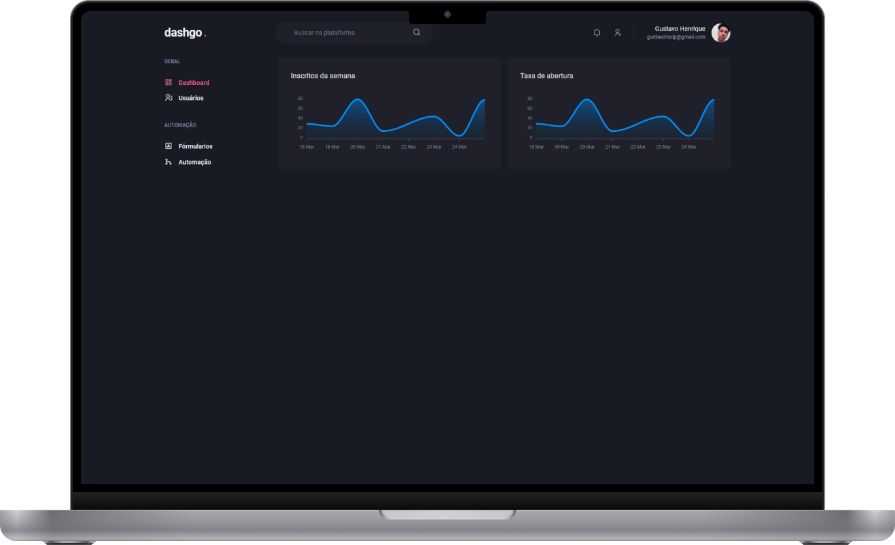
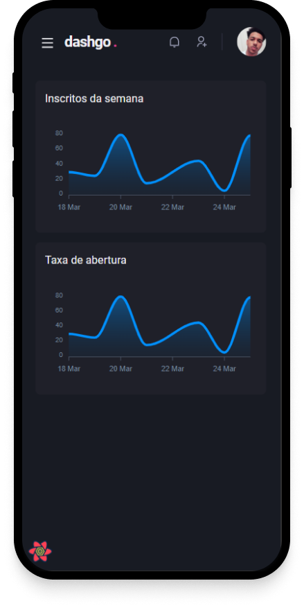

<h1 align="center">
  <strong>Dashgo 💜 | Dashboard made with Chakra UI</strong>
</h1>

&nbsp;

<p align="center">
  
</p>

## 📚 Project information

- This project was developed during chapter IV of Ignite Rocketseat! The idea was to develop a dashboard completely using the Chakra UI, also making the application responsive.

&nbsp;

## 💻 What's in the project?

- Complete design using Charka UI, also with its responsive version.
- Error checking form fields using Yup + React Hook Form.

&nbsp;

<p align="center">
  
</p>

&nbsp;

## 🛠️ Technologies/Tools used

- [React](https://pt-br.reactjs.org/E)
- [Next.js](https://nextjs.org/)
- [Chakra UI](https://chakra-ui.com/)
- [Yup](https://github.com/jquense/yup)
- [React Hook Form](https://react-hook-form.com/)

&nbsp;

## ⚙️ Installation

```
# Open terminal and clone this repository
$ git clone https://github.com/Gustavohsdp/DashGo
```

```
# Access the application folder
$ cd DashGo

# Install dependencies
$ npm install
# or
$ yarn install

# Start the application
$ yarn dev
#or
$ npm run dev

```

&nbsp;

## 📝 Licença

This project is licensed under the MIT License. See the archive of [LICENÇA](https://github.com/Gustavohsdp/DashGo/blob/master/LICENSE) for details.

---

<p align="center">Made with 💜 by Gustavo Henrique</p>
